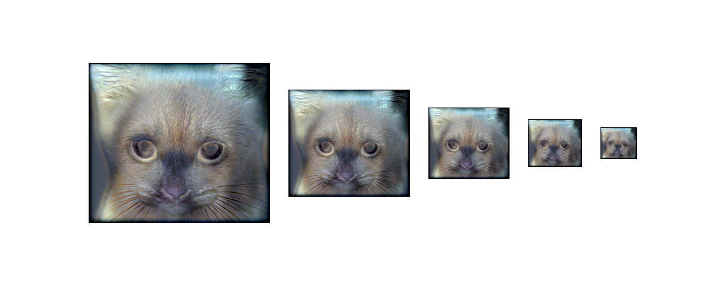

# Hybrid Image Generator

This project is a tool for creating hybrid images. These are optical illusions that combine two images where one image is only visible up close, with the other emerging when viewed from a distance.

## Demo

### 1. Cat --> Dog

#### Input images


#### Visualiser



### 2. Happy Mr Incredible --> Sad Mr Incredible

#### Input images


#### Visualiser


## Installation

1. **Clone the repository**
   ```bash
   git clone https://github.com/simran-ss-sandhu/Hybrid-Image-Generator.git
   ```
2. **Navigate to the project directory**
   ```
   cd Hybrid-Image-Generator
   ```
3. **Set up a virtual environment (optional but recommended)**
   - **Windows**
      ```bash
     python -m venv venv
      source venv\Scripts\activate
     ```
   - **UNIX (Linux, MacOS, etc.)**
      ```bash
      python -m venv venv
      source venv/bin/activate
      ```
4. **Install dependencies**
   ```bash
   pip install -r requirements.txt
   ```

## Usage

To create a hybrid image, run the following command in the project directory:
```bash
python src/main.py --i <near_image_path> <far_image_path> --o <output_image_path> [--s <low_sigma> <high_sigma>] [--v]
```

### Arguments

- `--i`, `--input`: Required
  - Type: `str`
  - Specifies the paths to the 2 input images. These images will be used to generate the hybrid image.
    - The 1st image becomes clearer as you closer
    - The 2nd image becomes clearer as you move further away
  - Example:
     ```bash
    --input data/happy.png data/sad.png
    ```
- `--o`, `--output`: Required
  - Type: `str`
  - Specifies the path to save the generated hybrid image.
  - Example:
     ```bash
    --output output.png
    ```
- `--s`, `--sigma`: Optional
  - Type: `int`
  - Specifies the integer sigma values for the filters:
    - 1st value is for the Low-pass filter
    - 2nd value is for the High-pass filter
  - Example:
     ```bash
    --sigma 6 17
    ```
  - If not provided, default values are used.
- `--v`, `--visualiser`: Optional
  - Opens a window to visually showcase the hybrid image effect.

